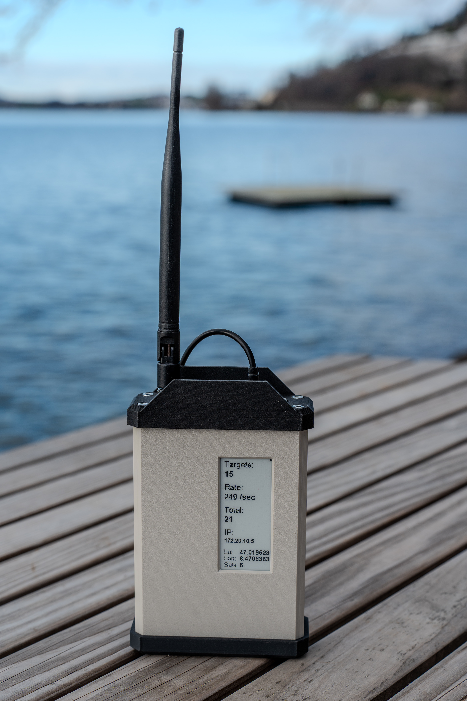
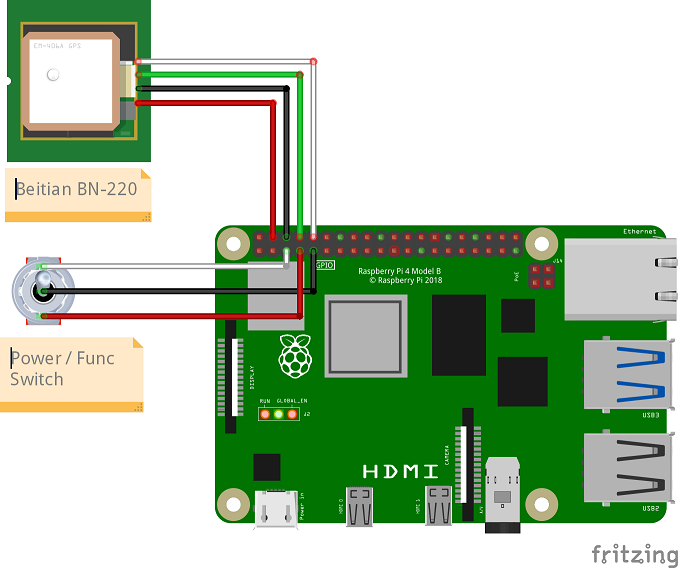

# Portable Receiver Display Software

The Portable Receiver Display Software, or PRDS, is a Python software for a mobile ADS-B (and later VDL2 and ACARS) receiver intended to run on a Raspberry Pi. It uses a E-Ink display and an optional GPS module to display useful stats.

 

## Hardware Suggestions

The harware below was used for the development build of the portable receiver. Other Hardware might also work...

- Raspberry Pi 3/4/5
- Software Defined Radio (The Nooeelec SDRs fit well into the case)
- Waveshare 2.9inch E-Ink display module (296x128) (https://www.waveshare.com/2.9inch-e-paper-module.htm)
- (optional) GPS Module - Beitian BN-220
- Momentary Toggle Switch (ON)-OFF-(ON), for 6mm hole diameter (https://www.amazon.com/dp/B07PJ577HK?ref_=cm_sw_r_cp_ud_dp_3SB3N0XC1KQG5GVA277V)*
- USB-C Panel Mount (https://www.amazon.com/dp/B0C5D79HXB?ref_=cm_sw_r_cp_ud_dp_ZVZHC8CQEJ09X0SSW703)*
- USB-C to Micro-USB Cable about 30cm long (https://a.co/d/3ogZZP9)*
- USB-A extension about 30cm long (https://www.amazon.com/dp/B08MKW47QD?ref_=cm_sw_r_cp_ud_dp_AZDTF1CSXVHBJWJWEEYY)*
- Power source (either portable battery bank or wallplug) with 5V 2A output.

*The Amazon links are for reference only. Exact product availability and fit may not be guaranteed!

### 3D Printed Parts

The case for the portable receiver has been 3D printed. Files, required hardware and information about the 3D printed case can be on Printables: https://www.printables.com/model/720951-portable-pi-sdr-case

 

## Wiring Guide

1. Connect the switch and the optional wiring diagramm as shown here:

_The GPS receiver is optional, but highly recommended!_

2. Connect the E-Ink display as explained here: [WaveShare Wiki](https://www.waveshare.com/wiki/2.9inch_e-Paper_Module_Manual#Working_With_Raspberry_Pi)

3. Connect the SDR to a free USB port with the USB-A extension cable.

4. Connect the USB-C to Micro-USB cable from the USB-C Panel mount to the Raspberry Pi.

 

## Software Installation

1. Install Linux Image on Raspberry SD card and boot the Pi.
Recommended: Raspberry Pi OS Lite (64-bit)

2. Install readsb + tar1090 on the Pi as explained here: https://github.com/wiedehopf/adsb-scripts/wiki/Automatic-installation-for-readsb

3. (Optional) Install the automatic gain adjustment script, as explained here: https://github.com/wiedehopf/adsb-scripts/wiki/Automatic-gain-optimization-for-readsb-and-dump1090-fa
   (This is required if you want the automatic gain adjustment function on Page 5 to work).
   

5. Run the automatic installation script by running the following command:

   		sudo bash -c "$(wget -O - https://raw.githubusercontent.com/JN-Husch/Portable-Receiver-Display/main/scripts/adsb_installer.sh)"
 
	(It is also possible to manually install the software, see [docs/manual_installation.md](docs/manual_installation.md) for instructions.

5. (Optional) If you want to use the GPS module, follow these instructions to set it up: [docs/gps.md](docs/gps.md)

6. Reboot your Pi by running:

		sudo reboot

	After your Pi has re-booted, the display should now automatically start up and show ADSB-Data.

 

## Software Update

To update the PRD Software, follow these steps:

1. Connect to your Pi via SSH.

2. Run the following command:

   		sudo bash -c "$(wget -O - https://raw.githubusercontent.com/JN-Husch/Portable-Receiver-Display/main/scripts/adsb_installer.sh)"

	Alternatively, you can also manually update, by running the following commands:

		cd /home/pi
		sudo rm -r PRDS
		git clone --depth 1 --no-checkout https://github.com/JN-Husch/Portable-Receiver-Display.git PRDS
		cd PRDS
		git sparse-checkout set ADSB
		git checkout
		sudo systemctl restart PRDS-ADSB.service
 

## Software Removal

To automatically remove the PRD Software follow these steps:

1. Connect to your Pi via SSH.

2. Run the following command:

		sudo bash /home/pi/PRDS/ADSB/uninstall.sh

	Alternatively, you can manually uninstall the PRD Software by following this guide: [docs/manual_uninstallation.md](docs/manual_uninstallation.md)
